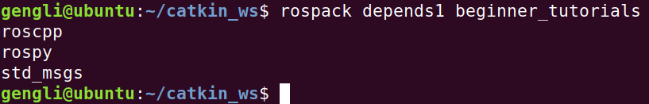

# 第三节 创建package

本节介绍ROS package的创建，参加[此处](http://wiki.ros.org/ROS/Tutorials/CreatingPackage)。

### 1. 什么是package

package就是一个模块，就像Python、Java等有各种包。知道这个意思就行。

一个package至少有两个文件，```CMakeList.txt```和```package.xml```。这两个文件是一个package必须的，里面描述了该package编译的方式和所包含的文件等信息。

文件结构如下：

* my_package/
  * CMakeLists.txt
  * package

此外还可以多个包汇合在一个工作空间（workspace），此时文件结构如下：

* workspace_folder/

  * src/

    * CMakeLists.txt

    * package_1/

      * CMakeLists.txt
      * package.xml

      ...

    * package_n/

      * CMakeLists.txt
      * package.xml

即用一个CMakeLists.txt文件来组织多个包。

### 2. 创建一个package

首先创建文件夹（说得高大上一点就是工作空间workspace），这个可以自己定。我创建在本用户目录下，使用ROS基本都用普通用户，不用root用户。在ROS中，package通常放在一个叫```src```的目录下：

```bash
mkdir -p ~/catkin_ws/src
cd ~/catkin_ws/src
```

然后创建一个叫beginner_tutorials的包，指定依赖于 std_msgs, rospy 和roscpp的package：

```
catkin_create_pkg beginner_tutorials std_msgs rospy roscpp --rosdistro moledic
```

用```--rosdistro moledic```是因为我们用的是 moledic 版本的ROS。catkin_create_pkg的用法是

```
catkin_create_pkg <package_name> [depend1] [depend2] [depend3]
```

此时我们的目录结构如下：


### 3. 构建（build）工作空间并初始化文件

```bash
cd ~/catkin_ws
catkin_make
```

如果你接着上一节内容，请确保是新打开的终端，或在原来终端下运行 ```source ~/.bashrc```，确保```catkin_make```命令能运行。

运行完上面命令，用```ls```命令查看，发现多了个```devel```的文件夹。为了把我们这个工作空间加入到环境变量中，需要执行初始化文件，命令为

```
. ~/catkin_ws/devel/setup.bash
```

不过这在每个终端都要执行，为了让每次打开终端都自动运行，我们可以把这句命令加在 ```~/.bashrc```最后面。命令为：

```
echo "~/catkin_ws/devel/setup.bash" >> ~/.bashrc
```

### 4. package依赖

使用```rospack depends1 [package_name]```来查看直接依赖，用```rospack depends [package_name]```看所有依赖，运行：

```bash
rospack depends1 beginner_tutorials
```

输出如下：



### 5. 总结

这一节的关键内容是用```catkin_create_pkg```来创建一个工作空间。下一节讲解```package.xml```和```CMakeLisdts.txt```文件的构成。