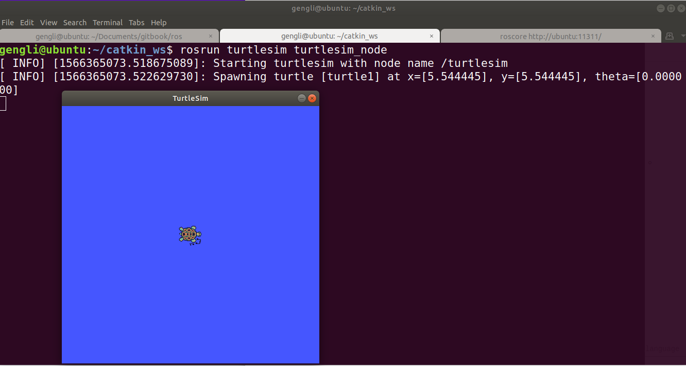

# 第一节 ROS Nodes

本节主要介绍ROS Nodes，官方文档见[这里](http://wiki.ros.org/ROS/Tutorials/UnderstandingNodes)。

### 1. 概览ROS

ROS中常常用到几个概念，官方的介绍如下（英文不好，翻译地不好见谅）：

* Nodes: 一个节点（node）是一个可以和其他节点交流的执行器
* Messages: 当订阅（subscribe）或发布（publis）一个话题（topic）时的ROS数据
* Topics: 节点（Nodes）能发布一个话题（topic），也能订阅一个话题（topic），订阅一个话题就是接收数据
* Master: ROS的名称服务（比如用来帮助两个节点（node）互相发现对方）
* rosout: 等效于标准输出和标准错误输出
* roscore: Master + roscore + 参数服务（参数服务后面会介绍）


感觉上面说的不好懂，其实说人话就好懂了，用在淘宝上买东西来举个例子，因为Node、Messages等都是ROS很常用的名词，下面就把它们当专业名词用，不翻译成中文了。

在淘宝上买东西，商家和顾客要交流买东西相关的信息，我们就以买保温杯为例。那么，每个顾客是一个Node，每个商家也是一个Node，那么保温杯就是Messages，可见Messages是实实在在的内容。Topics描述谁是卖家、谁是买家等信息，注意到这种信息不是实体。Master当然就是淘宝这个平台了，让商家和顾客能相互建立起联系。

至于roscore，就相当于启动了整个保温杯买卖市场，这样各种交易才能正常进行。如果关闭，人们连有种商品叫保温杯都不知道。

商家和顾客有多个、商品有多种、描述也有多种，对应多个Node、多种Message、多个Topics。

### 2. roscore

启动roscore，很简单，在第一个终端输入

```bash
roscore
```

让整个时间开始运转，如果因为文件夹权限而失败，尝试运行下面1行命令：

```
sudo chown -R <your_username> ~/.ros
```

下面开始看节点，打开一个新的终端（*new terminal*)，输入

```bash
rosnode list
```

可以看见

```bash
/rosout
```

这个节点在运行ROS是自动都打开（否则啥东西都不显示在终端，也不知到ROS在干嘛）。

### 3. rosun

要打开其他节点，用命令

```
rosrun [pacakge_name] [node_name]
```

善于用tab键自动补全或双击tab显示可选列表，可以提高效率。

比如要打开一个在 turtlesim package里面的叫 turtlesim_node 的节点，那就运行：

```bash
rosrun turtlesim turtlesim_node
```

好了，可以看到一只海龟了，如下：



如果要改变显示的图片的标题，如改成 my_turtle，那就运行：

```bash
rosrun turtlesim turtlesim_node __name:=my_turtle
```

### 4. 总结

概况地说，本节的最终效果就3行命令，依次在3个终端输入：

```
roscore
rosrun turtlesim turtlesim_node
rosnode list
```

* roscore = ros + core
* rosrun = ros + run
* rosnode = ros + node

按Ctrl+C（或Ctrl+Shift+C）关闭程序。下一节讲解 ROS Topics。