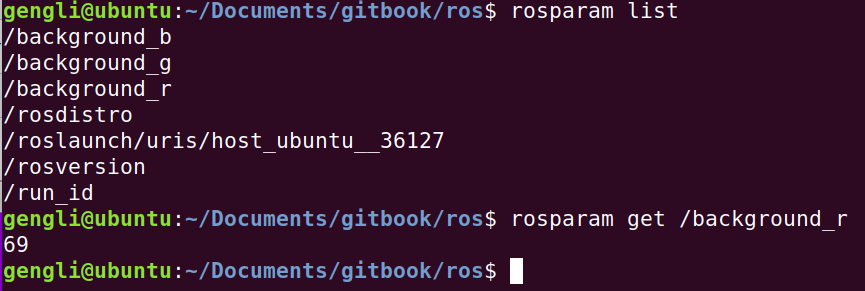
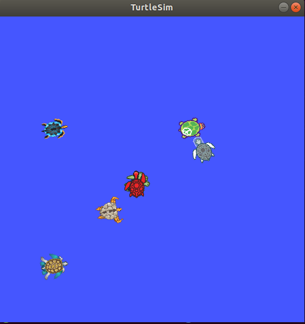
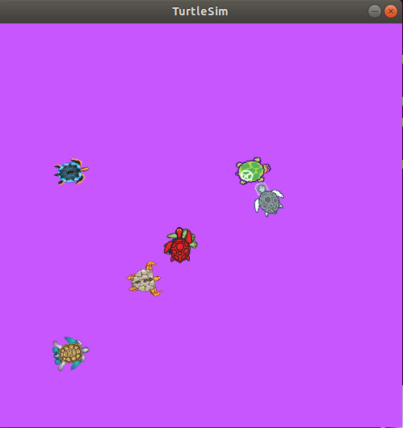

# 第四节 ROS Parameters

这一节讲解ROS Parameters，就是一些ROS参数的设置。

### 1. 常用命令

```bash
rosparam set            # 设置参数
rosparam get            # 获取参数
rosparam load           # 从文件加载参数
rosparam dump           # 把参数保存到文件
rosparam delete         # 删除参数
rosparam list           # 显示当前的所有参数名
```


### 2. 实践

如果没打开小海龟，请依次新建终端并输入：

```bash
roscore
rosrun turtlesim turtlesim_node
```

#### 2.1 查看与设置

首先自然是看看有那些参数，新打开终端，输入

```bash
rosparam list
```

再看看 /background_r 的值吧，运行

```bash
rosparam get /background_r
```

输出如下：



此时我的海龟如下（为什么多只参见上一节），



假设要模拟发生了赤潮，那可以把背景的红色（/background_r）的数字增大一些，用的就是 rosparam，运行

```bash
rosparam set /background_r 200
rosservice call /clear #刷新一下
```

之后，图变得如下：



要一次获取所有参数及其内容，运行：

```bash
rosparam get /
```

#### 2.2 保存与加载

使用：

```bash
rosparam dump [file_name] [namespace]
rosparam load [file_name] [namespace]
```

栗子：

```bash
rosparam dump params.yaml
rosparam load params.yaml copy # copy这个可以自由换成其他名字
```

### 3. 总结

这一节主要讲设置一些ROS运行环境的参数，其实在真正仿真中用的不多。命令一开始就列出来了。下一节介绍一下很常用的 ROS launch。