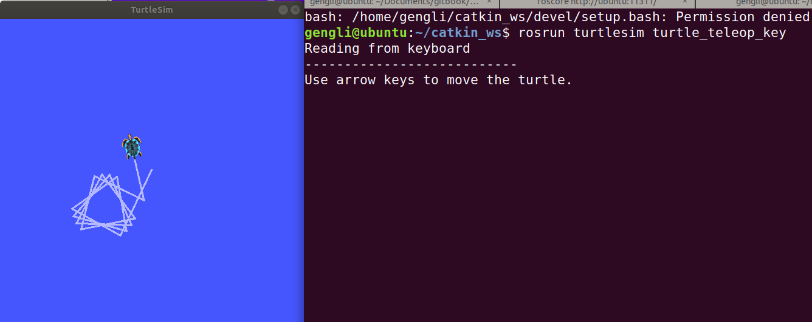
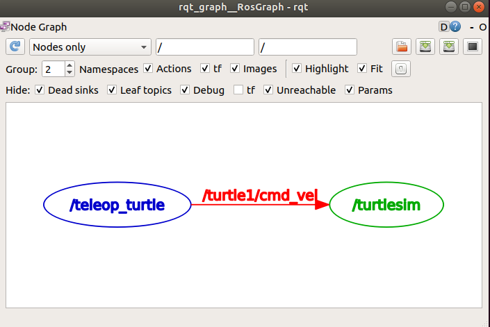
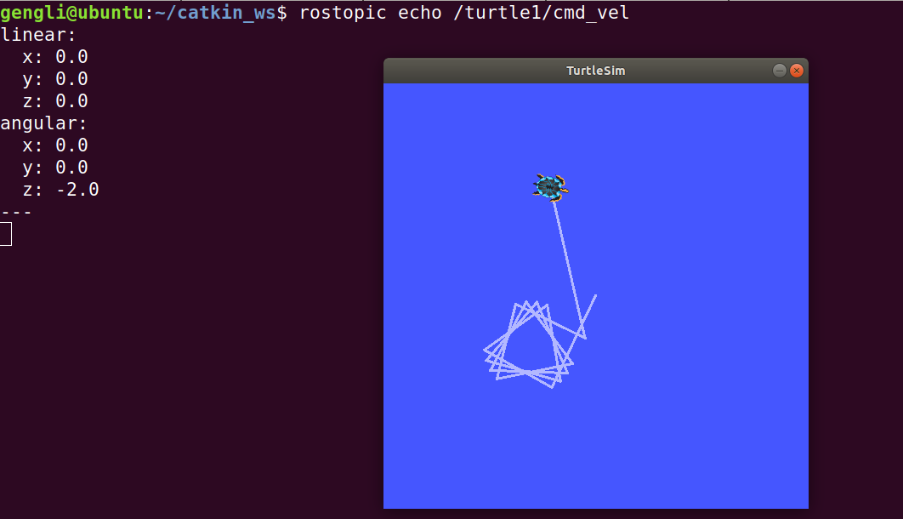
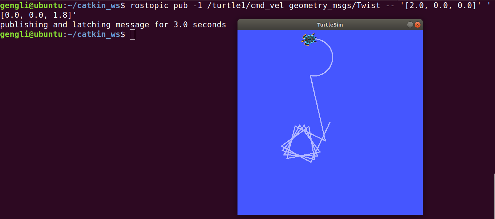

# 第二节 ROS Topics

不积跬步，无以至千里。千里之行，始于足下。

今天介绍ROS Topics，这是一个很重要的概念，如果运行错误，可能是当初没有安装完整版的ROS。本节内容见官网[此处](http://wiki.ros.org/ROS/Tutorials/UnderstandingTopics)。

### 1. 启动

上一节我们让海龟出现，我们先让它动一动。依次输入以下命令，每次一个终端：

```bash
roscore
rosrun turtlesim turtlesim_node
rosrun turtlesim turtle_teleop_key
```

输完第3条时鼠标就可以用键盘上的上下左右键控制海龟运动了（如果没反应，保证鼠标在控制终端，单击一下）。

效果如下：



不要关闭上面的终端，下面要用。

### 2. 使用 rqt_graph

前面我们把Nodes比作淘宝上交易保温杯的顾客和商家，Topics就是描述了保温杯的买卖双方的信息及交易的商品，这些信息不是实体。保温杯（message）才是实体。顾客买保温杯，自然只接受保温杯，因此顾客接受保温杯时肯定会检查是不是Topic里面指定的东西，不是则拒收。为了更好地可视化，我们就用ROS的一个叫 rqt_graph 的工具。

我们再新打开一个终端，输入 

```bash
rosrun rqt_graph rqt_graph
```

运行 rqt_graph package里面 rqt_graph 节点，结果如下图：



鼠标放在下面的椭圆上就显示颜色。上图代表一个叫 /teleop_turtle 的节点和一个叫 /turtlesim 的节点，他们topic是 /turtle1/cmd_vel，也就是说 /turtlesim 只接收 /turtle1/cmd_vel 这个topic指定的类型的数据。怎样看这个类型呢？

### 3. 查看rostopic及对应Message

牢记Topics不是实体，Messages是实体，Topics和Messages都有类型，一般Topics和Messages有对应关系，但不一定是一对一，可能一对多，也可能多对一。

```bash
rostopic type /turtle1/cmd_vel #查看消息类型

rosmsg show geometry_msgs/Twist #查看该类型消息对应的信息
```

我们会依次看到输出

```bash
geometry_msgs/Twist

geometry_msgs/Vector3 linear
  float64 x
  float64 y
  float64 z
geometry_msgs/Vector3 angular
  float64 x
  float64 y
  float64 z
```


我们再来看看 /turtle1/cmd_vel 的实际数据是怎样的，用

```bash
rostopic echo [/topic_name]
```

显示 /teleop_turtle 和 /turtlesim 之间发布的Topic对应的Messages（实体）。我们这里新打开一个终端，输入

```bash
rostopic echo /turtle1/cmd_vel
```

此时终端还是没有任何输入，因为没有发布Messages，回到用键盘控制海龟动的界面，让海龟动一下，我们就可以发现输出了一些内容，类似下图：



### 4. rostopic pub

刚刚我们要发布（publish）消息，用的是通过写好的按键控制程序，发布消息，然后让控制海龟动，然后自动发送消息。其实还可以通过控制台发布消息，格式为：

```bash
rostopic pub [topic] [msg_type] [args]
```

我们这里就是新打开一个终端，输入：

```bash
rostopic pub -2 /turtle1/cmd_vel geometry_msgs/Twist -- '[2.0, 0.0, 0.0]' '[0.0, 0.0, 1.8]'
```

其中 -1 代表发布1次（可以改成 -r 1）一直发布（-r 后面的1代表发布频率），海龟就一直傻傻地转圈圈，后面的参数也可以自己指定。之后海龟运动如图：



### 5. 总结

本节的效果就是让海龟转圈圈，依次在新打开的终端输入以下命令可以见效果：

```bash
roscore
rosrun turtlesim turtlesim_node
rostopic pub /turtle1/cmd_vel geometry_msgs/Twist -r 1 -- '[2.0, 0.0, 0.0]' '[0.0, 0.0, -1.8]'

rosrun rqt_graph rqt_graph #可选，可视化Topics流向
```

下一节介绍 Services 通信方式。