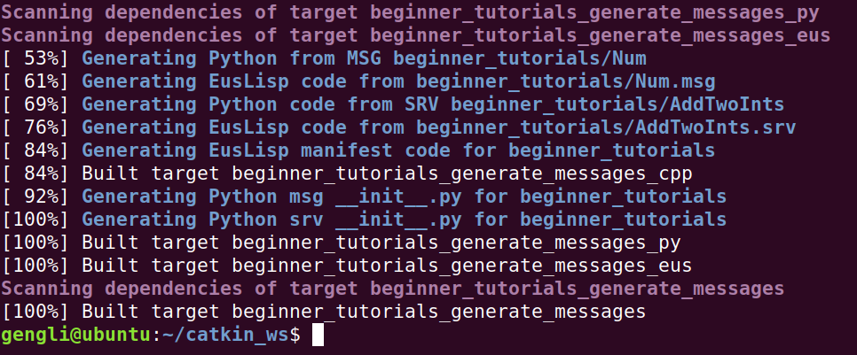

# 第七节 ROS rossrv

本节介绍 rossrv，其实和上一节介绍的 rosmsg 非常相似，rossrv 是用在 Services 通信时的，也和结构体比较像，但有返回值。

### 1. 样例

```bash
int64 A
int64 B
---
int64 Sum
```

A、B是通信时请求的参数， Sum是返回值。请求和返回之间用“---”隔开，够简单了。

### 2. 使用 srv

#### 2.1 创建   Sum.srv

srv 自然是放在 package 下的 srv/ 文件夹里面。命令如下：

```bash
cd ~/catkin_ws/src/beginner_tutorials
mkdir srv
gedit srv/AddTwoInts.srv
```

这时会打开一个文件，我们把样例中的内容复制到里面，关闭文件就好。

#### 2.2 修改文件

如果跟着上一节来，这里修改就很简单，package.xml 文件照前面一节做，在此不赘述，需要修改 CmakeLists.txt 文件的 add_service_files()，取消注释（或直接自己重新写），内容如下：

```cmake
add_service_files(
  FILES
  AddTwoInts.srv
)
```

#### 2.3 显示 srv

在终端运行如下代码，显示如下：

```bash
rossrv show beginner_tutorials/AddTwoInts
```


报错的话看看是不是在 ~/catkin_ws 文件夹及其子文件下。

### 3. 编译

其实我们不修改 package.xml 和 CMakeLists.txt 文件，上面内容还是能查看的，因为 ROS 会自动在 package 所在文件夹里寻找 msg/，srv/ 等文件夹下的内容。

但这些对我们后面的用 C++ 和 Python 编程等不方便，我们可以通过编译产生 msg 或 srv 对应的 C++ 文件。命令如下（保证在我们的工作空间文件夹下，这里是 catkin_ws/）

```bash
cd ~/catkin_ws/
catkin_make
```

最终最后几行如下：



要查看生成的文件，对于C++，在 *~/catkin_ws/devel/include/beginner_tutorials/*文件夹下，对于 Python，在*~/catkin_ws/devel/lib/python2.7/dist-packages/beginner_tutorials/* 文件夹下，如下图：


### 4. 总结

以上便是 srv 的内容。从此节开始，我们会遇到更多需要编程的内容。多思考总结，方能运用自如。下一节开始讲解如何用 C++ 写一个 publisher 和 一个 subscriber。