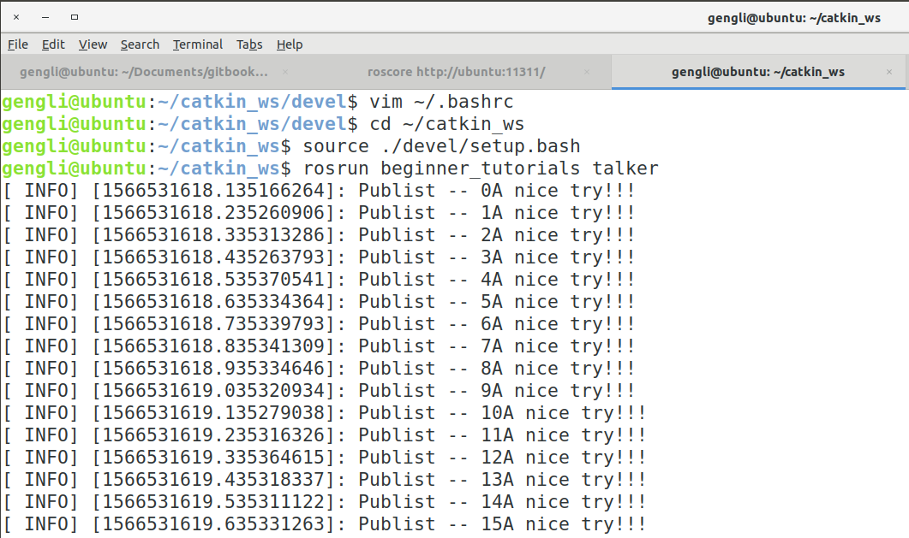

# 第二节 运行Topics通信

上一节讲了Topics C++ 编程实现，怎么调用呢？其实很简单。

### 1. 运行

先睹为快，依次在三个终端输入：

```bash
roscore
```

```bash
cd ~/catkin_ws
source ./devel/setup.bash
rosrun beginner_tutorials talker
```

```bash
rosrun beginner_tutorials listener
```

在第2个和第三个终端就可以看见输出了。分别如下：




### 2. 总结

至此，Topics通信运行完成，按Ctrl+C（有的是Ctrl+Shift+C）完成取消输出。下一节讲Services通信。