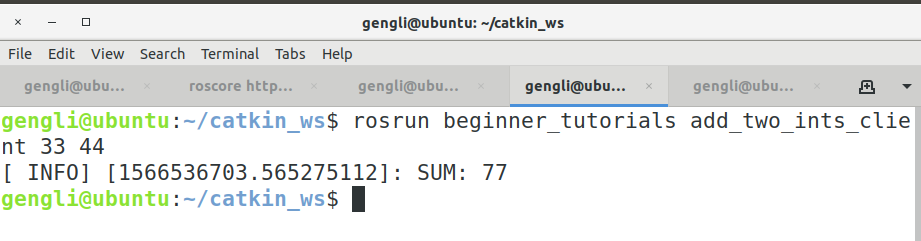

# 第二节 C++实现Services通信

这一节介绍C++实现Services通信。

### 1. 准备

下面代码中会用到我们在第二章第七节讲到的内容，会调用里面编译好的 C++ 头文件。当初我们定义的 srv 文件内容如下：

```bash
int64 A
int64 B
---
int64 Sum
```

### 2. 代码

打开 beginner_tutorials/src/，新建的 add_two_ints_server.cpp 和 add_two_ints_client.cpp 保存在该文件夹下。

#### 2.1 client 端

```c++
#include "ros/ros.h"
#include "beginner_tutorials/AddTwoInts.h"
#include <cstdlib>

int main(int argc, char **argv)
{
    ros::init(argc, argv, "add_two_ints_client");
    if (argc != 3)
    {
        ROS_INFO("使用方法： add_two_ints_clent X Y");
    }
    
    ros::NodeHandle n;
    // "add_two_ints" 是连接客户端和服务器端的关键
    ros::ServiceClient client = n.serviceClient<beginner_tutorials::AddTwoInts>(
    "add_two_ints");
    
    beginner_tutorialsv::AddTwoInts srv;
    srv.request.A = atoi(argv[1]);
    srv.request.B = atoi(argv[2]);
    
    if (client.call(srv))
    {
        ROS_INFO("SUM: %d", (int) srv.response.Sum);
    }
    else
    {
        ROS_ERROR("Failed to call service add_two_ints");
        return 1;
    }
    
    return 0;
}
```


#### 2.2 server 端

```c++
#include "ros/ros.h"
#include "beginner_tutorials/AddTwoInts.h"

bool add(beginner_tutorials::AddTwoInts::Request &req, 
        beginner_tutorials::AddTwoInts::Response &res )
{
    res.Sum = req.A + req.B;
    ROS_INFO("request: x=%d, y=%d", (int)req.A, (int)req.B);
    ROS_INFO("response:sum = %d", (int)res.Sum);
    
    return true;
}

int main(int argc, char **argv)
{
    ros::init(argc, argv, "add_two_ints_server");
    ros::NodeHandle n;
    
    /* 通过 n.advertiseService() 返回一个ServiceServer对象，收到请求后执行 add() 函数 */
    ros::ServiceServer service = n.advertiseService("add_two_ints", add);
    ROS_INFO("Ready to add two ints.");
    
    ros::spin();
    
    return 0;
}
```

### 3. 编译

在 beginner_tutorials 下面的 CMakeLists.txt 文件最后添加如下几行：

```cmake
add_executable(add_two_ints_server src/add_two_ints_server.cpp)
target_link_libraries(add_two_ints_server ${catkin_LIBRARIES})
add_dependencies(add_two_ints_server beginner_tutorials_gencpp)

add_executable(add_two_ints_client src/add_two_ints_client.cpp)
target_link_libraries(add_two_ints_client ${catkin_LIBRARIES})
add_dependencies(add_two_ints_client beginner_tutorials_gencpp)
```

下面在终端运行：

```bash
cd ~/catkin_ws
catkin_make
```

### 4. 运行Nodes

分别在三个终端输入：

```bash
roscore
```

```bash
rosrun beginner_tutorials add_two_ints_server
```

```bash
rosrun beginner_tutorials add_two_ints_client 33 44
```

第2,3个终端输出如下：




### 5. 总结

以上便是 Services 通信的C++实现。和之前的Topics对比，差别不大，只是这里的客户端的 serviceClient() 和服务端的 advertiseService() 两个函数名字感觉不好记。下面本来是要讲Python的，但感觉两个一起学反而容易混乱。