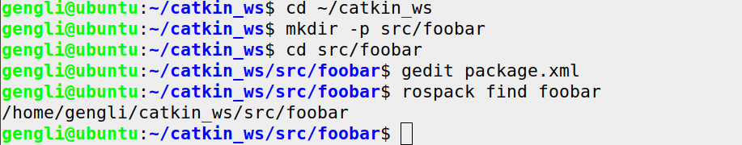

# 第一节 手动创建ROS Package

我们有一个创建ROS Packages的工具（[catkin_create_pkg](http://wiki.ros.org/catkin/commands/catkin_create_pkg) ），`catkin_create_pkg`可以防止错误并且减少工作量，但实际上它也只是创建了一个文件夹和一个简单的 XML 文件。

这一节我们要创建一个新的名为 `foorbar` 的package，确保你工作在 catkin workspace并且已经运行过 setup 文件。我的 catkin workspace 是 ~/catkin_ws 。

### 1. 创建文件夹

```bash
cd ~/catkin_ws
mkdir -p src/foobar
cd src/foobar
```

### 2.  package.xml

`package.xml` 文件运行`rospack`等命令能获得package的依赖信息。我们的 `foobar/package.xml`内容如下：

```xml
<package format="2">
	<name>foobar</name>
    <version>1.2.4</version>
    <description>这个package提供foo功能</description>
    <maintainer email="1225714785@qq.com">Geng Li</maintainer>
    <license>BSD</license>
    
    <buildtool_depend>catkin</buildtool_depend>
    
    <build_depend>roscpp</build_depend>
    <build_depend>std_msgs</build_depend>
    
    <exec_depend>roscpp</exec_depend>
    <exec_depend>std_msgs</exec_depend>
</package>
```

更多关于 [catkin/package.xml](http://wiki.ros.org/catkin/package.xml) 的信息。

新建的包有了`package.xml`文件，ROS就能找到。执行下面命令：

```bash
rospack find foobar
```

效果如下：



现在我们的package依赖于[roscpp](http://wiki.ros.org/roscpp) 和 [std_msgs](http://wiki.ros.org/std_msgs) 。

### 3. CMakeLists.txt

下面写 [CmakeLists.txt](http://wiki.ros.org/CMakeLists) 文件，cmake具有跨平台优势，走到哪里都能用。

`foobar/CMakeLists.txt`的内容如下：

```cmake
cmake_minimun_required(VERSION 2.8.3)
project(foobar)
find_package(catkin REQUIRED roscpp std_msgs)
catkin_package()
```


以上就是手动创建package的方法。下一节我们看看怎样管理系统依赖。