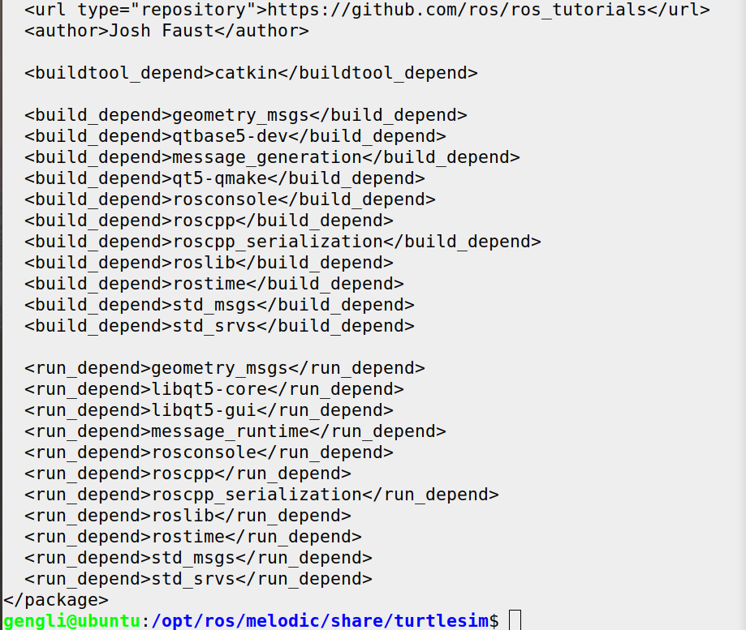
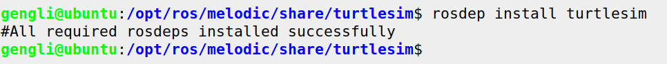

# 第二节 管理系统依赖

ROS包有时需要一些额外的库，有时系统中并没有这些库，这时就需要自己安装。ROS提供了一种一个简单的工具，`rosdep`，可以很好地解决系统依赖问题。

系统依赖必须在`package.xml`中声明好，我们先看看 turtlesim 的系统依赖，运行：

```bash
roscd turtlesim
cat package.xml
```

效果如下：



那些由`<build_depend>  </build_depend>`标签包含的内容就是系统依赖内容。

### 1. rosdep

使用方法：

```bash
rosdep install [package]
```

给 turtlesim 下载并安装系统依赖：

```bash
# 如果不是第一次运行，前两行命令不需要
sudo rosdep init
rosdep update

rosdep install turtlesim
```

如果成功，就输出如下：

> ```
> All required rosdeps installed successfully
> ```

否则会看到安装依赖的输出：

> ```bash
> #!/usr/bin/bash
> 
> set -o errexit
> set -o verbose
> 
> 
> if [ ! -f /opt/ros/lib/libboost_date_time-gcc42-mt*-1_37.a ] ; then
>   mkdir -p ~/ros/ros-deps
>   cd ~/ros/ros-deps
>   wget --tries=10 http://pr.willowgarage.com/downloads/boost_1_37_0.tar.gz
>   tar xzf boost_1_37_0.tar.gz
>   cd boost_1_37_0
>   ./configure --prefix=/opt/ros
>   make
>   sudo make install
> fi
> 
> if [ ! -f /opt/ros/lib/liblog4cxx.so.10 ] ; then
>   mkdir -p ~/ros/ros-deps
>   cd ~/ros/ros-deps
>   wget --tries=10 http://pr.willowgarage.com/downloads/apache-log4cxx-0.10.0-wg_patched.tar.gz
>   tar xzf apache-log4cxx-0.10.0-wg_patched.tar.gz
>   cd apache-log4cxx-0.10.0
>   ./configure --prefix=/opt/ros
>   make
>   sudo make install
> fi
> ```

`rosbash` 运行上面的bash脚本，完成后结束。

我的没有报错，运行 `rosdep install [pkg_name]`的时候要在package文件夹下。效果如下：



