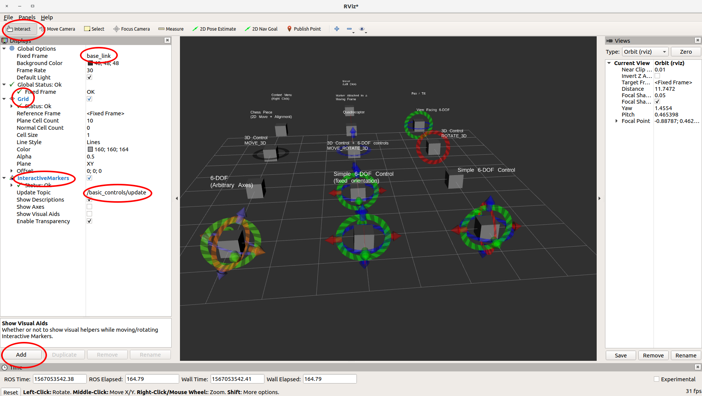
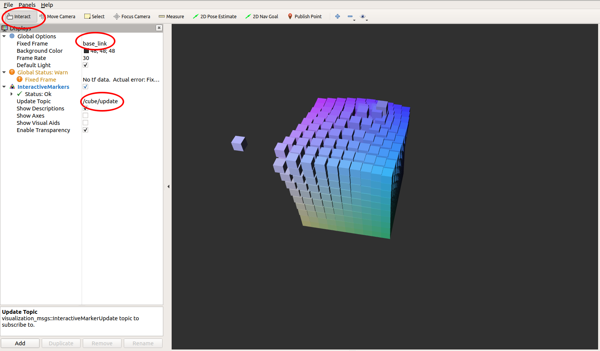

# 第四节 可交互的形状

内容参考[官方文档](http://wiki.ros.org/rviz/Tutorials/Interactive%20Markers%3A%20Getting%20Started)。

### 1. 介绍

交互性的形状和之前说过的形状很相似，但多了一些可以改变位置、旋转的属性。我们这一节不介绍源码，主要看看ROS自带的几个例子。

### 2. 实例

ROS的 [interactive_marker_tutorials](http://wiki.ros.org/interactive_marker_tutorials) package包含了5个交互性的例子：[simple_marker](http://wiki.ros.org/rviz/Tutorials/Interactive Markers%3A Getting Started#simple_marker), [basic_controls](http://wiki.ros.org/rviz/Tutorials/Interactive Markers%3A Getting Started#basic_controls), [menu](http://wiki.ros.org/rviz/Tutorials/Interactive Markers%3A Getting Started#menu), [pong](http://wiki.ros.org/rviz/Tutorials/Interactive Markers%3A Getting Started#pong) 和 [cube](http://wiki.ros.org/rviz/Tutorials/Interactive Markers%3A Getting Started#cube).

#### 2.1 basic_controls

如果对源代码感兴趣，可以参考官方源代码，有[C++版本](https://github.com/ros-visualization/visualization_tutorials/blob/indigo-devel/interactive_marker_tutorials/src/basic_controls.cpp) 和[Python版本](https://github.com/ros-visualization/visualization_tutorials/blob/indigo-devel/interactive_marker_tutorials/scripts/basic_controls.py)。

在三个终端依次运行以下代码：

```bash
roscore
```

```bash
rosrun interactive_marker_tutorials basic_controls
```

```bash
rosrun rviz rviz
```

可以看见打开了rviz界面，进行以下设置：

- 把 *fixed frame* 设置成 */base_link*
- 点击 *Display* 面板上的 *Add* ，增加一个 *Interactive Markers* 显示（不懂的见本章第二节）
- 把显示的 *update topic* 设置成 */basic_controls/update*。设置完后会马上看到几个灰色的立方体
- 在工具面板（panel）中选择 *Interact* 。可以看到一些坐标轴等等。
- 可以增加一个 *Grid* 显示（方法同增加 *Interactive Markers* ，有时默认就有网格），方便看形状的移动。

效果如下，我把关键设置的地方用红圈圈出来。：




#### 2.2 cube

官方给了好几个例子，感觉这个cube的还不错。源代码，[C++](https://github.com/ros-visualization/visualization_tutorials/blob/indigo-devel/interactive_marker_tutorials/src/cube.cpp) 和[Python](https://github.com/ros-visualization/visualization_tutorials/blob/indigo-devel/interactive_marker_tutorials/scripts/cube.py) 。

先关闭之前的rviz，（roscore先不要关），运行：

```bash
rosrun interactive_marker_tutorials cube
```

```bsh
rosrun rviz rviz
```

效果和关键设置如图：




#### 2.3 其他

其他三个例子见[官网](http://wiki.ros.org/rviz/Tutorials/Interactive%20Markers%3A%20Getting%20Started)。


### 3. 总结

本节主要是直观感受一下交互式的效果，其实源代码和之前的普通形状的很类似。下一节我们来用代码实现简单的交互。