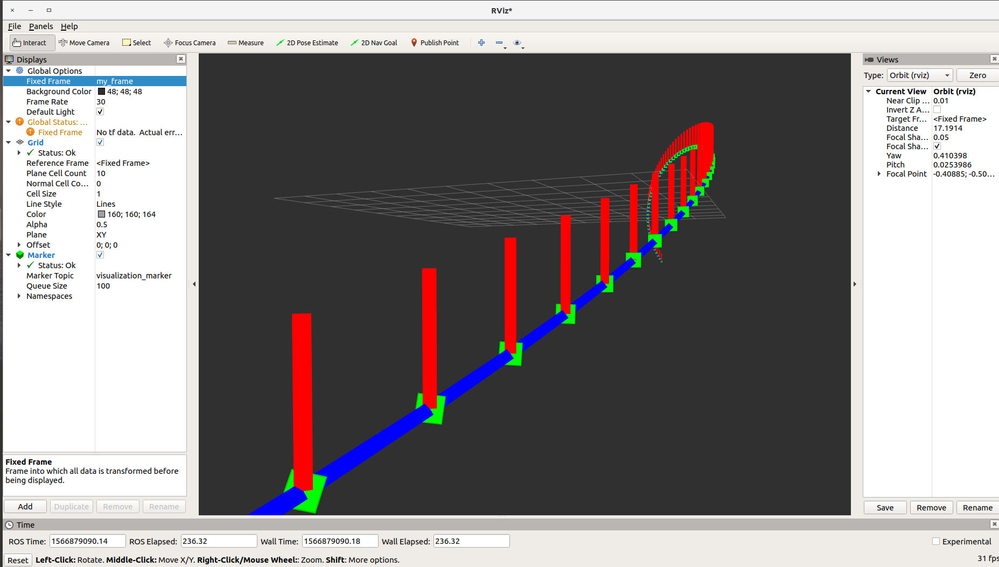

# 第三节 箭头和线（C++）

### 1. 简介

上一节我们学习了怎样想rviz发送简单的形状，这一节将讲解怎样发送点（POINTS），线条（LINE_STRIP），线列表（LINE_LIST）。官方文档见[此处](http://wiki.ros.org/rviz/Tutorials/Markers%3A%20Points%20and%20Lines)。

### 2. 使用点，线条和线列表

点，线条和线列表等形状都是 [visualization_msgs/Marker](http://docs.ros.org/api/visualization_msgs/html/msg/Marker.html) 信息（message）的成员，

点就是普通的点；线条是多个点依次连接，第1点连第2点，第2点连第3点，以此类推；线列表也有多个点，但点之间两两相连。

#### 2.1 代码

官方文档[代码](https://raw.githubusercontent.com/ros-visualization/visualization_tutorials/indigo-devel/visualization_marker_tutorials/src/points_and_lines.cpp) 和我写的非注释部分内容一致。文件保存在上一节建的 `using_markers/src/` 文件夹下，名称为 `points_and_lines.cpp` 。 

```c++
#include <ros/ros.h>
#include <visualization_msgs/Marker.h>

#include <cmath>

int main(int argc, char** argv)
{
    ros::init(argc, argv, "points_and_lines");
    ros::NodeHandle n;
    ros::Publisher marker_pub = n.advertise<visualization_msgs::Marker>("visualization_marker", 10);
    ros::Rate r(30);
    
    float f = 0.0;
    while (ros::ok())
    {
        // 初始化形状，未设置的位姿默认值为 0
        visualization_msgs::Marker points, line_strip, line_list;
        points.header.frame_id = line_strip.header.frame_id = line_list.header.frame_id = "/my_frame";
        points.ns = line_strip.ns = line_list.ns = "points_and_lines";
        points.action = line_strip.action = line_list.action = visualization_msgs::Marker::ADD;
        points.pose.orientation.w = line_strip.pose.orientation.w = line_list.pose.orientation.w = 1.0;
        
        points.id = 0;
        line_strip.id = 1;
        line_list.id = 2;
        
        points.type = visualization_msgs::Marker::POINTS;
        line_strip.type = visualization_msgs::Marker::LINE_STRIP;
        line_list.type = visualization_msgs::Marker::LINE_LIST;
        
        // 尺度（scale），不同形状有不同的尺度描述，点有高度和宽度
        // 线只有宽度，因为它们是点连起来，线长由点位置确定
        // 尺度的单位是米（m）
        // 点形状宽度和高度的尺度
        points.scale.x = 0.2;
        points.scale.y = 0.2;
        
        // 线条和线列表只有x方向的尺度
        line_strip.scale.x = 0.1;
        line_list.scale.x = 0.1;
        
        // 下面设置颜色，点为绿色，线条为蓝色，线列表为红色
        // Points are green
        points.color.g = 1.0f;
        points.color.a = 1.0;

        // Line strip is blue
        line_strip.color.b = 1.0;
        line_strip.color.a = 1.0;

        // Line list is red
        line_list.color.r = 1.0;
        line_list.color.a = 1.0;
        
        // 给点和线创建顶点
        for (uint32_t i = 0; i < 100; ++i)
        {
            float y = 5 * sin(f + i / 100.0f * 2 * M_PI);
            float z = 5 * cos(f + i / 100.0f * 2 * M_PI);
            
            geometry_msgs::Point p;
            p.x = (int32_t) i - 50;
            p.y = y;
            p.z = z;
            
            points.points.push_back(p);
            line_strip.points.push_back(p);
            
            // 线列表每行需要两个点
            line_list.points.push_back(p);
            p.z += 1.0;
            line_list.points.push_back(p);
        }
        
        marker_pub.publish(points);
        marker_pub.publish(line_strip);
        marker_pub.publish(line_list);
        
        r.sleep();
        
        f += 0.04;
    }
}
```

#### 2.2 编译

修改 `using_markers/CMakeLists.txt` ，在末尾添加如下两行，让编译系统编译上面的C++文件。

```camke
add_executable(points_and_lines src/points_and_lines.cpp)
target_link_libraries(points_and_lines ${catkin_LIBRARIES})
```

然后回到工作空间，运行

```bash
catkin_make
```

#### 2.3 查看形状

依次打开三个终端，输入：

```bash
roscore
```

```bash
rosrun rviz rviz
```

```bash
rosrun using_markers points_and_lines
```

注：如果上一节的运行`rosrun using_markers basic_shapes` 没有关闭的话先关闭，否则会有影响，因为我们两个文件中的 `frame_id = "/my_frame"` 。

同上一节一样修改rviz中的一些参数，最终效果如下：




### 3. 总结

总的来说这一节内容和上一节的很相似。这两节的形状，都是自己固定好的，我们不能在运行的时候对它们进行移动，旋转等，下一些介绍的怎样实现和形状的交互性操作。


