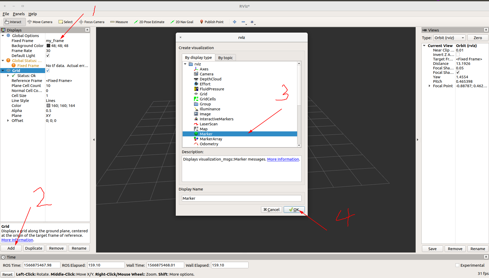
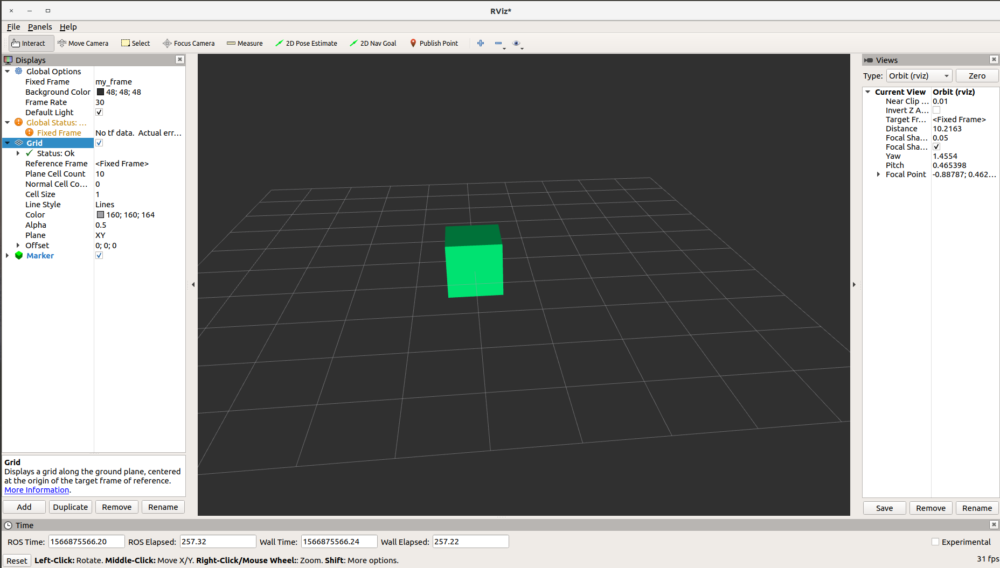

# 第二节 发送简单形状（C++）

### 1. 简介

[Marker Display](http://wiki.ros.org/rviz/DisplayTypes/Marker) 和其他显示不一样，你可以在rviz中可视化数据，尽管rviz根本不知道如何解析数据。我们送给显示器的对象是 [visualization_msgs/Marker](http://docs.ros.org/api/visualization_msgs/html/msg/Marker.html) messages，这些 messages 可以用来显示箭头、正方体、箭头和线段。

本节介绍怎样把四种基本形状（长方体、球、圆柱体和箭头）显示出来。我们会创建一段程序，每秒发送一个新的形状，代替上一个形状。

### 2. 创建一个 Package

```bash
catkin_create_pkg using_markers roscpp visualization_msgs
```

### 3. 发送形状（Markers）

#### 3.1 代码

把[代码](catkin_create_pkg using_markers roscpp visualization_msgs) 拷贝进 `using_markers/src/basic_shapes.cpp` 。

#### 3.2 代码解释

```c++
// 包含 visualization_msgs/Marker message
#include <ros/ros.h>
#include <visualization_msgs/Marker.h>

int main(int argc, char** argv)
{
    /* 下面这几行看起来很熟悉，就是ROS创建话题的步骤 */
    ros::init(argc, argv, "basic_shapes");
    ros::NodeHandle n;
    ros::Rate r(1);
    // 定义一个话题，名字为 visualization_marker
    ros::Publisher marker_pub = n.advertise<visualization_msgs::Marker>("visualization_marker", 1);
    
    // 用一个整数来保存上一次发布的形状，便于下一次变换
    // 其实这是预定义的，一种形状用一个整数来表示，很多工程都有类似做法
    uint32_t shape = visualization_msgs::Marker::CUBE;
    
    while (ros::ok())
    {
        visualization_msgs::Marker marker;
        // 设置 frame ID和时间戳
        // 这里的 frame ID在rviz的时候要用
        marker.header.frame_id = "/my_frame";
        marker.header.stamp = ros::Time::now();
        
        // 命名空间和ID是用来给形状创建一个唯一的名字
        // 同一命名空间下相同ID的形状，新的形状会覆盖旧的形状
        marker.ns = "basic_shapes";
        marker.id = 0;
        
        // 设置形状类型，初始是立方体，后面是和球体、箭头、圆柱体的循环。
        marker.type = shape;
        
        // 设置形状动作，有增加（ADD），删除(DELETE)，删除所有（DELETEALL）
        // 其实这里的ADD容易有误解，它真实意思是“创建或修改”
        marker.action = visualization_msgs::Marker::ADD;
        
        // 设置位姿，相对于标头（/my_frame）帧有6个自由度
        marker.pose.position.x = 0;
        marker.pose.position.y = 0;
        marker.pose.position.z = 0;
        marker.pose.orientation.x = 0.0;
        marker.pose.orientation.y = 0.0;
        marker.pose.orientation.z = 0.0;
        
        // 设置形状的比例 -- 1x1x1 表示每边1m。
        marker.scale.x = 1.0;
        marker.scale.y = 1.0;
        marker.scale.z = 1.0;
        
        // 设置颜色和透明度 -- 不要让 a=0， 否则完全透明
        marker.color.r = 0.0f;
        marker.color.g = 1.0f;
        marker.color.b = 0.5f;
        marker.color.a = 1.0;
        
        // 形状存在的时间，ros::Duration() 表示从不自动删除
        marker.lifetime = ros::Duration();
        
        // 发布形状，如果没有订阅者，发一个警告信息
        while (marker_pub.getNumSubscribers() < 1)
        {
            if (!ros::ok())
            {
                return 0;
            }
            ROS_WARN_ONCE("请给形状添加一个订阅者！");
            sleep(1);
        }
        marker_pub.publish(marker);
        
        // 在不同的形状之间循环
        switch (shape)
        {
            case visualization_msgs::Marker::CUBE:
                shape = visualization_msgs::Marker::SPHERE;
                break;
            case visualization_msgs::Marker::SPHERE:
                shape = visualization_msgs::Marker::ARROW;
                break;
            case visualization_msgs::Marker::ARROW:
                shape = visualization_msgs::Marker::CYLINDER;
           		break;
            case visualization_msgs::Marker::CYLINDER:
                shape = visualization_msgs::Marker::CUBE;
                break;
        }
        
        r.sleep();
    }
}
```

#### 3.3 编译

首先编辑 `using_markers` 包里面 `CmakeLists.txt` 文件，在最后添加以下两行，让编译系统知道我们要编译此包（package）。注：以后无特殊说明的话，默认 “package” 和 ”包“ 意思相同。

```cmake
add_executable(basic_shapes src/basic_shapes.cpp)
target_link_libraries(basic_shapes ${catkin_LIBRARIES})
```

保存后回到工作空间目录，比如我的是 `~/catkin_ws/`，然后 `catkin_make` 编译：

```bash
cd [你的工作空间目录]
catkin_make
```

#### 3.4 运行代码

编译没有报错的话，分别打开两个终端，分别输入以下代码（暂时不要关闭终端）：

```bash
roscore
```

```bash
rosrun using_markers basic_shapes
```

如果这一步提示找不到包等错误，确保已经运行过 `source [工作空间目录]/devel/setup.bash` 。

### 4. 显示形状

上面的内容还看不到任何东西，你可能已经迫不及待地想看看效果，马上。新打开一个终端，运行：

```bash
rosrun rviz rviz
```

此时已经打开 rviz。此时如下操作：

1. 修改全局设置（Global Options）的固定帧（Fixed Frame）为 "/my_frame"；
2. 点击左下角“ADD”，打开面板上选择“Marker”，点击“OK”，即可看见形状。

操作和结果如下：





### 5. 总结

至此，我们了解了怎样用C++代码来显示简单的形状，对初学者来说，可能代码比较多，其实代码就做了三件事：

- 定义Topics
- 定义形状并设置其属性
- 发布Topics

写好C++文件，自然要修改`CmakeLists.txt` 文件来编译，最后用rviz可视化。下一节，我们看看发布点和箭头，这听起来好像更简单，其实效果更好看。